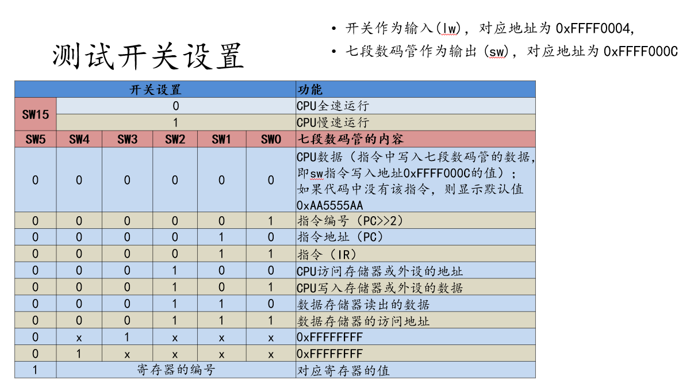

# Wuhan University 2023-2024 Academic Year Computer Science Honors Program RISC-V CPU Pipeline Design

 

## Project Structure

### modelsim

This folder contains the simulation code implemented using `modelsim`, which has successfully passed the test cases in the `test` folder.

### test

This folder contains test cases for verifying the pipeline CPU design in `modelsim`, as well as Fibonacci and student ID sorting programs for testing in `vivado`.

### vivado

This folder includes all necessary files for implementing the CPU design on an FPGA (**NEXYS A7**), including constraint files, top-level files, and CPU implementation files. These files are capable of running the Fibonacci sequence and student ID sorting programs from the `test` folder.

### img

This folder contains image files related to the project.

## Notes

- The project only implements the following instructions:
    - I0: LUI, AUIPC
    
    - I1: LB, LH, LW, LBU, LHU, SB, SH, SW
    
    - I2: ADD, SUB, SLL, SLT, SLTU, XOR, SRL, SRA, OR, AND

    - I3: ADDI, SLTI, SLTIU, XORI, ANDI, ORI, SRLI, SRAI, SLLI 
    
    - I4: JAL, JALR, BEQ, BNE, BLT, BGE, BLTU, BGEU
      
  For any other instructions needed, please add them yourself.

- For vivado debugging logic, please refer to the following image:

## Usage Instructions

- In the `modelsim` folder, you can find the simulation code that has passed the test cases.
- In the `test` folder, you can find test cases for verifying the pipeline CPU design, as well as programs for testing in `vivado`.
- In the `vivado` folder, you can find all the files necessary for implementing the CPU design on an FPGA.
- In the `img` folder, you can find images related to the project.

Please ensure to follow the above instructions and notes when using this project. If you need to implement additional instructions, do so based on the code logic.
