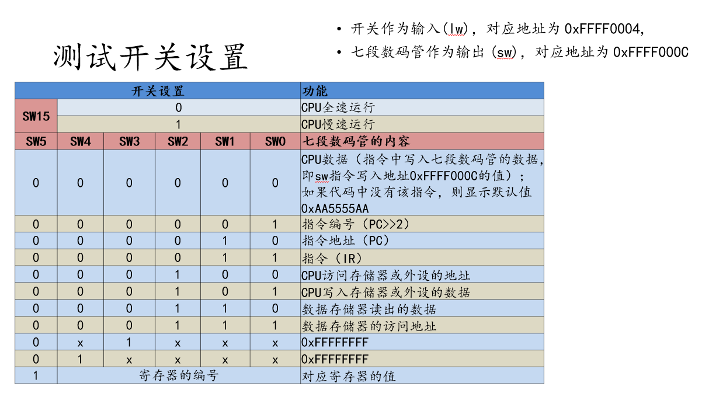

 # 武汉大学2023-2024学年 计卓班 计算机组成与设计 RISC-V CPU 流水线设计

 

[English](readme-en.md)

## 项目结构

### modelsim

此文件夹包含使用`modelsim`进行仿真的代码，这些代码已经通过了`test`文件夹中的测试用例验证。

### test

该文件夹包含用于验证`modelsim`中流水线CPU设计的测试用例，以及用于`vivado`测试的斐波那契数列和学号排序程序。

### vivado

此文件夹包含在FPGA（**NEXYS A7**）上实现流水线CPU设计所需的全部文件，包括约束文件、顶层文件和CPU实现文件。这些文件能够运行`test`文件夹中的斐波那契数列和学号排序程序。

### img

此文件夹包含项目相关的图片文件。

## 注意事项

- 本项目仅实现了如下指令: 
    - I0: LUI, AUIPC
    
    - I1: LB, LH, LW, LBU, LHU, SB, SH, SW
    
    - I2: ADD, SUB, SLL, SLT, SLTU, XOR, SRL, SRA, OR, AND

    - I3: ADDI, SLTI, SLTIU, XORI, ANDI, ORI, SRLI, SRAI, SLLI 
    
    - I4: JAL, JALR, BEQ, BNE, BLT, BGE, BLTU, BGEU
    
  其他指令如果需要，需要自行添加。

## 使用说明

- 在`modelsim`文件夹中，可以找到用于仿真的代码，这些代码已经通过了测试用例的验证。
- 在`test`文件夹中，可以找到用于验证流水线CPU设计的测试用例，以及用于`vivado`测试的程序。
- 在`vivado`文件夹中，可以找到在FPGA上实现CPU设计所需的全部文件。
- 在`img`文件夹中，可以找到与项目相关的图片文件。

请确保在使用本项目时，遵循上述说明和注意事项。如果需要实现额外的指令，请根据代码逻辑进行补充。
